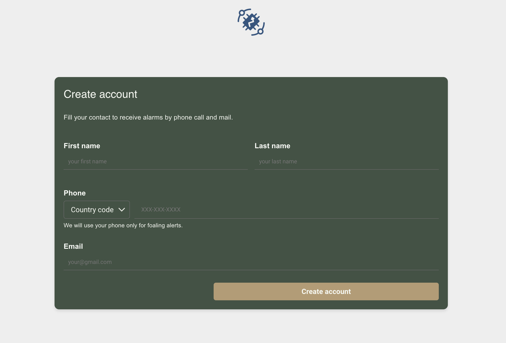

# ThingsBoard Public Dashboard with User Registration and Device Management

## Overview

This project enables user to create new accounts (self registration) via a public dashboard in Thingsboard Community edition. It also sets up an AWS API Gateway to securely receive user data from the form without exposing sensitive JWT tokens directly. The data is processed via an AWS Lambda function that performs the following actions:

- Creates a new customer and user in ThingsBoard.
- Assigns the public dashboard to the newly created customer.
- Creates a new device linked to the user for monitoring purposes.

By using an API Gateway, this project ensures that tenant JWT tokens are not passed explicitly through the public dashboard, enhancing security.



**Security Consideration**: The API Gateway will handle communication between the public dashboard and the backend. This ensures that JWT tokens are not exposed in the browser.


## Project logic

- **Public Dashboard**: Displays data and includes a form for user registration.
- **API Gateway**: Receives user information submitted from the public dashboard form.
- **Lambda Function**: Handles customer and user creation, dashboard assignment, and device creation in ThingsBoard.


## Prerequisites

Before setting up this project, ensure you have the following:

- **ThingsBoard on premise**: A running instance of ThingsBoard.
- **AWS Account**: To create the API Gateway and Lambda function.
- **Email smtp configure** configure smtp credential from custom mail to be able to send mails. I use Zoho mail for this purpose.
- **Sample device** create a sample device with a device profile. This device will be copied and assigned to new customer. This is necesary because Community edition does not let you to assign many customers to a single device.

## Step-by-Step Process:


### 1. Create the Lambda Function

The Lambda function is responsible for handling user registration and device setup when triggered by the API Gateway. It performs the following tasks:

- Generates a JWT token using tenant credentials.
- Creates a new customer using the information received from the form.
- Assigns a public dashboard to the newly created customer.
- Sets the public dashboard as the home dashboard for the customer.
- Creates a new device linked to the customer.
- Copies telemetry data from a sample device to the new device.
- Updates server-side attributes for the new device.

#### Steps to Create the Lambda Function:

1. **Create a new Lambda function** in the AWS Lambda console.
- Go to the **AWS Lambda console** and create a new function with the following settings:
  - **Runtime**: Select **Python 3.11**.
  - **Other settings**: You can leave the remaining parameters at their default values (e.g., basic execution role, memory, timeout).

- **Copy and paste the code** from the `lambdafunction.py` folder of this repository into the Lambda function code editor.

- The Python code uses the **`requests`** library to communicate with the ThingsBoard API. AWS Lambda does not include this library by default, so you'll need to add it via a **Lambda layer**. There are two options to accomplish this:

  1. **Use a pre-built Lambda layer**:
     - Upload the provided `Lambda-layer.zip` file (found in lambda folder) as a new Lambda layer.
     - Attach the layer to your Lambda function. If necessary, you can link the layer to the function using its **Layer ARN**.

  2. **Create your own Lambda layer** (optional):
     - If you prefer, you can create a custom Lambda layer by packaging the `requests` library yourself. However, this process can be more complex and time-consuming. Using the provided `Lambda-layer.zip` is simpler and quicker.

2. **Edit the following placeholder definitions in the Lambda function code**:
   - `tb_url`: The URL of your ThingsBoard instance (e.g., `https://thingsboard.com`).
   - `homeDashboardId`: The ID of the dashboard you want to assign as the home dashboard for new customers.
   - `deviceCloneId`: The ID of a sample device from which telemetry data will be copied.
   - `device_profile_id`: The ID of the device profile associated with the sample device.
   - `keys`: A list of telemetry keys to copy from the sample device to the new device (e.g., `["battery", "temperature"]`).
  
   - **Improvement suggestion**: Define this variables as env variables.

3. **Set environment variables** in the Lambda console:
   - In the Lambda function settings, under **Environment Variables**, add the following variables:
     - `USERNAME`: Your ThingsBoard tenant username.
     - `PASSWORD`: Your ThingsBoard tenant password.
 While storing sensitive information like usernames and passwords in Lambda environment variables is generally considered safe (as they are encrypted and contained within the Lambda function), you can enhance security by reducing the exposure of these credentials:

   - **Improvement suggestion**: Instead of storing the username and password, consider manually generating a **JWT token** with an extended expiration time (e.g., several weeks or months). You can configure ThingsBoard to refresh this token periodically in the panel, thereby reducing the need to frequently regenerate the token.
   

4. **Test the Lambda function**:
   - In the Lambda console, open the **Test** tab and create a new test event using the following sample JSON payload:
   
   ```json
   {
     "title": "New Customer",
     "email": "your@email.com",
     "firstName": "John",
     "lastName": "Doe",
     "phone": "1234567890"
   }
 
### 2. Set Up API Gateway in AWS

In this step, you'll securely pass user data from the ThingsBoard dashboard to the backend without exposing sensitive information. If you're not an expert in AWS API Gateway, this is a general approach to follow. For more detailed instructions, refer to the [AWS guide](https://docs.aws.amazon.com/lambda/latest/dg/services-apigateway.html) or use tools like ChatGPT to help you configure it step-by-step.

#### Steps to Set Up API Gateway:

1. **Create a New REST API**:
   - In the AWS Management Console, navigate to **API Gateway** and select **Create API**.
   - Choose **REST API** and give your API a name (e.g., "User Registration API").
   - For the **Endpoint Type**, choose **Regional**.

2. **Create a POST Method**:
   - In the API Gateway dashboard, create a **POST** method under the resource path where you want to receive the user data (e.g., `/register`).
   - Select **POST** from the list of available methods.
   - For **Integration Type**, choose **Lambda Function**. Then, select the Lambda function you created in the previous step to handle user registration and device creation.

3. **Set Up Usage Plan and API Key**:
   To prevent abuse or malicious attempts to create unintended accounts, you can limit the number of API calls using a usage plan and API keys:
   
   - Create a **Usage Plan** in the API Gateway console, setting limits on the number of API calls (e.g., X requests per minute).
   - Enable **API Key Required** on the **POST** method under the resource.
   - Generate an **API Key**, which will be required for calling the API. This key should be configured and stored securely in the next steps.
   - Link the generated API Key to the usage plan you created, so that only a limited number of requests can be made with that key.

4. **Enable CORS**:
   - In the **POST** method settings, enable **CORS (Cross-Origin Resource Sharing)** to allow the ThingsBoard dashboard to communicate with your API.
   - In the CORS settings, make sure to include the URL of your ThingsBoard dashboard in the list of allowed origins.
   - Save your changes and deploy the API.
     
### 5. **Test API and Lambda Integration**:
   - Run `testAPIGateway.py` after updating the placeholder parameters (e.g., API URL, API key, user details).
   - Upon execution, the script should trigger the Lambda function and successfully create new users in ThingsBoard.


### 3. Create a Public Dashboard in ThingsBoard

**Objective**: Build a public-facing dashboard with a user registration form that sends data to API Gateway.

- Create a new dashboard in ThingsBoard and set it to public.
- Upload the HTML widget from the `dashboard` folder.
- Configure the following in the widget:
  - `const apiUrl = "your API URL with endpoint";`
  - `"x-api-key": "your API token";`
  - Optionally, update the logo in the `logo div`.

- For improved styling, modify the following in Dashboard settings:
  - Hide the toolbar.
  - Enable "Auto fill layout height."
  - Adjust background color as needed.
  - Disable "Apply margin to the sides of the layout."
  
- Test to ensure the form works as expected.

